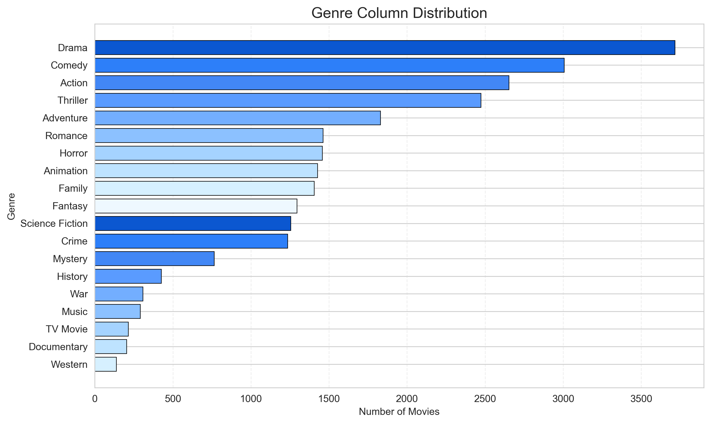
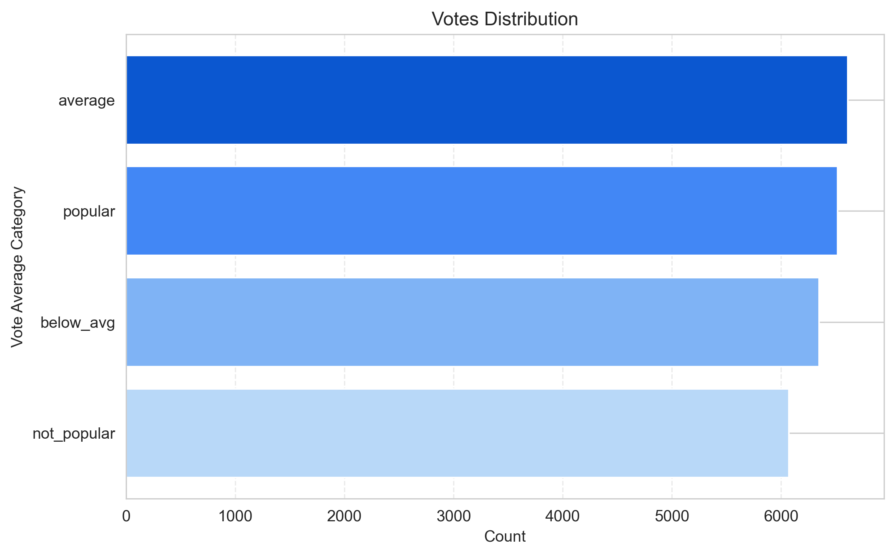
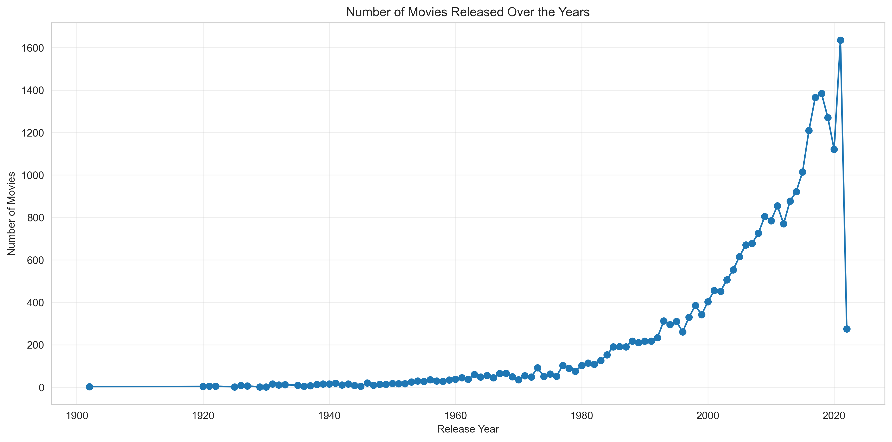

# 🎬 Netflix Movie Data Analysis

A beginner-friendly Exploratory Data Analysis (EDA) project built using **Python**, **Pandas**, **Matplotlib**, and **Seaborn**.

The objective of this project is to clean, transform, and analyze a Netflix movie dataset to discover trends related to genres, popularity, ratings, and movie releases.

---

##  Project Objectives

- Perform data cleaning and preprocessing.
- Explore movie genre distribution.
- Categorize movies based on vote averages.
- Analyze popularity trends.
- Study yearly movie release patterns.

---

##  Technologies Used

- Python
- Pandas
- NumPy
- Matplotlib
- Seaborn
- JupyterLab

---

##  Dataset Features

The dataset includes information such as:

- Movie Title
- Genre
- Release Date
- Popularity
- Vote Count
- Vote Average
- Original Language
- Poster URL

---

##  Data Preprocessing

The following preprocessing steps were performed:

- Converted `Release_Date` to datetime format.
- Extracted release year.
- Removed unnecessary columns.
- Created vote categories using quartiles.
- Split multiple genres into individual genres using `explode()`.
- Prepared a separate genre-level dataframe for analysis.

---

##  Exploratory Data Analysis

The project answers the following questions:

- Which genre appears most frequently?
- How are movies distributed across vote categories?
- Which movies have the highest popularity?
- Which year has the maximum movie releases?

---

##  Visualizations

The project contains visualizations including:

- Genre Distribution
- Vote Category Distribution
- Top 10 Most Popular Movies
- Movie Release Trend
- Average Vote by Genre

### Genre Distribution

### Vote Category Distribution

### Release Year Distribution

---

##  Key Insights

- Drama is the most frequent movie genre.
- Comedy, Action, and Thriller are among the most common genres.
- Spider-Man: No Way Home has the highest popularity score.
- 2021 recorded the highest number of movie releases.
- Popularity and vote count show a weak positive correlation.
- Splitting the Genre column enabled more meaningful genre-level analysis.

---

##  Future Improvements

- Add interactive Plotly visualizations.
- Build a Streamlit dashboard.
- Develop a basic movie recommendation system.
- Perform language-wise movie analysis.
- Compare movie trends across different decades.

---

##  Author

**Vivek Sourav**

