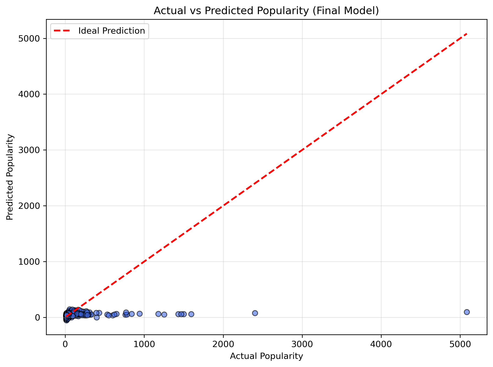

# 🎬 Netflix Movie Data Analysis & Popularity Prediction

A beginner-friendly Data Science project built using **Python**, **Pandas**, **Matplotlib**, **Seaborn**, and **Scikit-learn**.

This project demonstrates a complete Data Science workflow starting from **Exploratory Data Analysis (EDA)** to building and evaluating a **Linear Regression model** for predicting movie popularity.

---

# 📌 Project Objectives

- Perform data cleaning and preprocessing.
- Explore movie genre distribution.
- Analyze popularity trends and release patterns.
- Build a Linear Regression prediction model.
- Evaluate model performance using regression metrics.
- Compare multiple preprocessing experiments.
- Select the best-performing prediction model.

---

# 🛠 Technologies Used

- Python
- Pandas
- NumPy
- Matplotlib
- Seaborn
- Scikit-learn
- JupyterLab

---

# 📂 Project Structure

```text
01-Netflix-Data-Analysis/

│
├── 01-EDA.ipynb
├── 02-Movie-Popularity-Prediction.ipynb
├── mymoviedb.csv
├── requirements.txt
├── outputs/
│   ├── genre_distribution.png
│   ├── vote_distribution.png
│   ├── release_year_distribution.png
│   ├── final_model_prediction.png
│   └── final_predictions.csv
└── README.md
```

---

# 📊 Dataset Features

The dataset includes information such as:

- Movie Title
- Genre
- Release Date
- Popularity
- Vote Count
- Vote Average
- Original Language
- Poster URL

---

# 🧹 Data Preprocessing

The following preprocessing steps were performed:

- Converted `Release_Date` into datetime format.
- Extracted release year.
- Removed unnecessary columns.
- Created vote categories using quartiles.
- Split multiple genres into individual genres using `explode()`.
- Prepared a separate genre-level dataframe for analysis.
- Encoded categorical variables for Machine Learning.
- Applied Genre One-Hot Encoding.
- Performed feature selection for prediction.

---

# 📈 Exploratory Data Analysis

The first notebook answers questions such as:

- Which genre appears most frequently?
- How are movies distributed across vote categories?
- Which movies have the highest popularity?
- Which year has the maximum movie releases?
- What are the overall popularity trends?

---

# 🤖 Machine Learning

The second notebook focuses on predicting movie popularity using **Linear Regression**.

The workflow includes:

- Feature Selection
- Label Encoding
- Genre Encoding
- Train-Test Split
- Linear Regression Model
- Model Evaluation
- Model Improvement Experiments
- Final Model Selection

---

# 📊 Model Performance

Three different experiments were performed.

| Experiment | MAE | RMSE | R² Score |
|------------|----:|-----:|---------:|
| Baseline Linear Regression | 33.50 | 158.06 | 0.0300 |
| Genre Encoding | **33.48** | **157.52** | **0.0320** |
| Genre + Log Transformation | 34.65 | 157.93 | 0.0269 |

### ✅ Final Selected Model

The **Genre Encoding** experiment achieved the best performance and was selected as the final prediction model.

---

# 📷 Visualizations

### Genre Distribution


---

### Vote Category Distribution


---

### Release Year Distribution


---

### Final Prediction Model



---

# 🔍 Key Insights

- Drama is the most frequent movie genre.
- Comedy, Action, and Thriller are among the most common genres.
- Spider-Man: No Way Home has the highest popularity score.
- 2021 recorded the highest number of movie releases.
- Genre Encoding provided a slight improvement in prediction performance.
- Log Transformation normalized the Vote_Count distribution but did not improve the Linear Regression model.
- The available features show only a weak linear relationship with movie popularity.

---

# 📌 Final Conclusion

This project demonstrates the complete workflow of a Machine Learning project, starting from raw data exploration to model development and evaluation.

Three different Linear Regression experiments were conducted to improve prediction performance.

Among them, **Genre Encoding** produced the highest R² score and was selected as the final model.

Although the prediction pipeline was successfully implemented, the relatively low R² score indicates that movie popularity cannot be accurately predicted using the available features with a simple Linear Regression model.

This project highlights the importance of:

- Data Cleaning
- Feature Engineering
- Model Experimentation
- Performance Evaluation
- Evidence-based Model Selection

---

# 🚀 Future Improvements

- Collect additional movie-related features.
- Apply advanced feature engineering.
- Compare Linear Regression with Decision Tree Regression.
- Implement Random Forest Regression.
- Deploy the prediction model using Streamlit.
- Build a Movie Recommendation System.

---

# 👨‍💻 Author

**Vivek Sourav**

If you found this project helpful, feel free to ⭐ the repository.